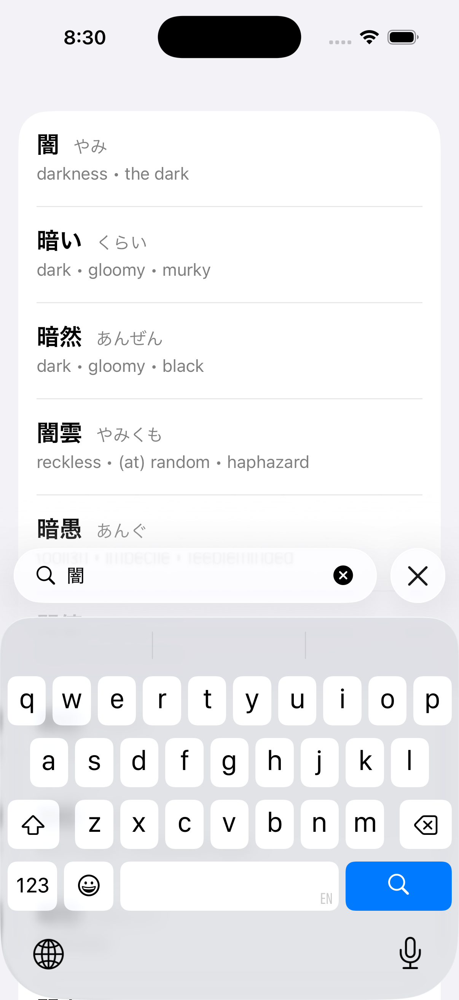
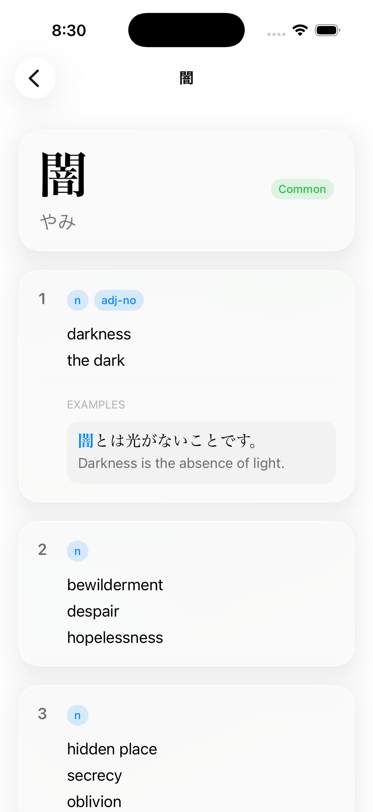

# JpDict

An offline Japanese dictionary for Swift. Builds a single SQLite file from
[JMdict-simplified](https://github.com/scriptin/jmdict-simplified) (with
Tatoeba example sentences) and exposes a small, typed API for searching
and looking up entries.

- **217,000+** dictionary entries from JMdict
- **Tatoeba example sentences** attached to senses where available
- Ranked search across **kanji / kana / English glosses**
- A clean Swift API — GRDB is an implementation detail, not part of the
  public surface
- Ships as a Swift Package; works on iOS 16+ and macOS 13+

---

## Example app

A SwiftUI example app demonstrating JpDict on **iOS** and **macOS** lives in
[`Examples/jpdictExample`](Examples/jpdictExample). Open
`Examples/jpdictExample/jpdictExample.xcodeproj` in Xcode and run the
`jpdictExample` scheme on either platform.

<p align="center">
  
  
</p>

---

## Requirements

- Swift **6.3+**
- macOS **13+** or iOS **16+**
- ~250 MB free disk while preparing the database (intermediates are
  cleaned up automatically)

## Installation

Add JpDict to your `Package.swift`:

```swift
dependencies: [
    .package(url: "https://github.com/otdnnc/JpDict.git", from: "0.1.0"),
],
targets: [
    .target(
        name: "MyApp",
        dependencies: [
            .product(name: "JpDict", package: "JpDict"),
        ]
    ),
]
```

The library has one transitive dependency:
[GRDB.swift](https://github.com/groue/GRDB.swift) 7.10+.

---

## 1. Prepare the database

JpDict deliberately does **not** bundle dictionary data — you build the
SQLite file yourself from the upstream JMdict-simplified release. This
keeps the package small and lets you re-build against newer dictionary
releases without waiting for a JpDict update.

```bash
git clone https://github.com/otdnnc/JpDict.git
cd JpDict
swift run jpdict-prepare
```

What that does, in order:

1. **Downloads** `jmdict-examples-eng-3.6.2+….json.tgz` (~25 MB) from
   the GitHub release. Skipped if the tarball is already in the current
   directory.
2. **Extracts** it to `jmdict-examples-eng-3.6.2.json` (~122 MB).
   Skipped if the JSON already exists.
3. **Decodes** the JSON and builds `jpdict.sqlite` (~150 MB) using GRDB.
   Inserts run in a single transaction with relaxed durability, then the
   file is `VACUUM`-ed back to default settings for portability.
4. **Cleans up** by deleting the tarball + JSON.

All artifacts are written to whatever directory you ran the command in —
typically the package root.

Expect 1–2 minutes end-to-end on a modern Mac.

### Re-running

`jpdict-prepare` always rebuilds `jpdict.sqlite` from scratch (any
existing file at the same path is overwritten), but it **skips**
download and extract steps if the inputs are already on disk. So if you
need to rebuild against the same source data, just delete the `.sqlite`
file and re-run.

### Pointing at a different release

The download URL and filenames are hardcoded in
`Sources/jpdict-prepare/Support/Paths.swift`. Update them to switch to a
newer JMdict-simplified release.

---

## 2. Shipping the database with your app

Once built, treat `jpdict.sqlite` as a static asset:

| Approach                | When to use                                         |
| ----------------------- | --------------------------------------------------- |
| **SPM resource**        | Smallish apps where ~150 MB bundle is acceptable    |
| **App bundle resource** | iOS/macOS app targets — add to Copy Bundle Resources |
| **Download on first run** | Apps that need to keep their installer small      |
| **Server-side**         | Backends — point at the file directly                |

Wherever it lives, you just need a filesystem path to it at runtime.

---

## 3. Using the library

```swift
import JpDict

// Connect (read-only). Open once and keep alive.
let dict = try JpDictionary(path: "/path/to/jpdict.sqlite")

// Search — accepts kanji, kana, or English; results ranked best-first.
let results = try dict.search("食べる", limit: 20)
for result in results {
    let primary = result.kanji ?? result.kana
    let meaning = result.glosses.joined(separator: "; ")
    print("\(primary) [\(result.kana)] — \(meaning)")
}

// Word detail — full entry with example sentences.
if let word = try dict.word(id: results[0].id) {
    for sense in word.senses {
        let pos = sense.partOfSpeech.joined(separator: ", ")
        let glosses = sense.glosses.map(\.text).joined(separator: "; ")
        print("[\(pos)] \(glosses)")

        for example in sense.examples {
            for sentence in example.sentences {
                print("  (\(sentence.lang)) \(sentence.text)")
            }
        }
    }
}
```

### Search ranking

`search(_:limit:)` returns the top `limit` matches, ranked best-first:

1. Exact kanji match
2. Exact kana match
3. Kanji prefix match
4. Kana prefix match
5. English gloss prefix match

`SearchResult` is intentionally lightweight — just enough to render a
results list. When the user picks a row, call `word(id:)` for the full
entry.

### Public types

| Type                 | Role                                                         |
| -------------------- | ------------------------------------------------------------ |
| `JpDictionary`       | Connect, search, word lookup. Thread-safe — open once.      |
| `SearchResult`       | Row in a search list: id, primary kanji, primary kana, gloss snippet |
| `Word`               | Full entry: kanji forms, kana readings, senses               |
| `Word.KanjiForm`     | One written form (text, common, tags)                        |
| `Word.KanaForm`      | One reading (text, common, tags, appliesToKanji)             |
| `Word.Sense`         | One meaning: part-of-speech + glosses + examples            |
| `Word.Gloss`         | One translation (lang, text, optional type/gender)           |
| `Word.Example`       | A Tatoeba example illustrating the sense                     |
| `Word.Sentence`      | One language variant of an example sentence                  |
| `Schema`             | Table-name constants + DDL — for writing custom queries     |
| `JMdict`             | Codable parse model of the source JSON — used by `jpdict-prepare` |

### Thread safety

`JpDictionary` is `Sendable`. All reads serialize through GRDB's
`DatabaseQueue`, so you can call from any thread — including
concurrently.

### Error handling

- `JpDictionary.Error.databaseMissing(path)` — thrown at `init` if no
  file exists at the given path.
- Any underlying SQLite error (corruption, schema mismatch) surfaces as
  a `DatabaseError` from GRDB.

---

## 4. Database schema (advanced)

If you want to write custom queries (full-text search, custom ranking,
faceted filters), here's the layout. JSON1 functions work on the
JSON-string columns (`tags`, `language_source`, etc.).

| Table              | Columns                                                                 |
| ------------------ | ----------------------------------------------------------------------- |
| `meta`             | `key, value` — source version, languages, dictDate                     |
| `tag`              | `tag, description` — JMdict tag dictionary                              |
| `word`             | `id` — one row per entry                                               |
| `kanji`            | `id, word_id, position, text, common, tags`                             |
| `kana`             | `id, word_id, position, text, common, tags, applies_to_kanji`           |
| `sense`            | `id, word_id, position, part_of_speech, applies_to_kanji, applies_to_kana, related, antonym, field, dialect, misc, info, language_source` |
| `gloss`            | `id, sense_id, position, lang, gender, type, text`                      |
| `example`          | `id, sense_id, position, source_type, source_value, text`               |
| `example_sentence` | `id, example_id, position, lang, text`                                  |

Indexes are defined on the obvious join columns (`word_id`, `sense_id`,
`example_id`) and on the searchable text columns (`kanji.text`,
`kana.text`, `gloss.text`).

Full DDL: [`Sources/JpDict/Database/Schema.swift`](Sources/JpDict/Database/Schema.swift).

---

## Project layout

```
Sources/
  JpDict/                       # The library
    Dictionary/                 #   JpDictionary + search/word extensions
    Models/                     #   Word, SearchResult, JMdict parse model
    Database/                   #   Schema (table names + DDL)
  jpdict-prepare/               # Executable that builds jpdict.sqlite
    Pipeline/                   #   Downloader, Extractor, DatabaseBuilder, Cleanup
    Support/                    #   Paths, errors
Tests/
  JpDictTests/                  # Swift Testing smoke tests (auto-skipped if no jpdict.sqlite)
```

## Running the tests

```bash
swift run jpdict-prepare   # produces jpdict.sqlite at the repo root
swift test
```

The suite is gated with `.enabled(if:)` on `jpdict.sqlite` existing at the
package root, so a fresh clone (without the database) still builds green.

---

## Attribution

JpDict combines several upstream data sources. **When you ship a product
using this database you must comply with their licenses.**

- **JMdict / EDICT** — [Electronic Dictionary Research and Development
  Group](https://www.edrdg.org/), licensed under
  [CC BY-SA 4.0](https://creativecommons.org/licenses/by-sa/4.0/).
  Include an attribution to "EDRDG" and the JMdict project in your
  app's About / Credits screen.
- **JSON conversion** —
  [scriptin/jmdict-simplified](https://github.com/scriptin/jmdict-simplified),
  release `3.6.2+20260525143653`.
- **Example sentences** — [Tatoeba Project](https://tatoeba.org/),
  licensed under
  [CC BY 2.0 FR](https://creativecommons.org/licenses/by/2.0/fr/).

## License

MIT recommended
